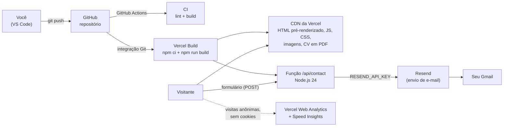

# Arquitetura e infraestrutura

Como o portfólio é construído, publicado e servido. O passo a passo para publicar está em [DEPLOY.md](./DEPLOY.md).

## Visão geral

- **Site estático na CDN.** O HTML já sai pronto do build (pré-render) e é servido pela CDN global da Vercel. Não há servidor rodando para montar páginas.
- **Uma única função no servidor:** `api/contact.ts`, que recebe o formulário e envia o e-mail. É o único lugar com chave secreta.
- **Tudo cabe nos planos gratuitos** de GitHub, Vercel e Resend, respeitadas as observações sobre o plano Hobby em [Custos e limites](#custos-e-limites).

## Componentes

| Componente | Onde roda | Papel |
|---|---|---|
| Repositório | GitHub | Código-fonte. Cada push na `main` gera um deploy de produção. |
| CI (`.github/workflows/ci.yml`) | GitHub Actions | Roda lint e build em cada push e pull request. Mostra ✅/❌ no GitHub. |
| Build | Vercel | `npm ci` + `npm run build`, com Node 24 (definido em `package.json` → `engines`). |
| Site | CDN da Vercel | Arquivos de `dist/`: páginas, JS, CSS, fontes, imagens, PDFs. |
| `api/contact.ts` | Vercel Functions (Node.js, região padrão `iad1`) | Valida o formulário, aplica o limite por IP e envia pelo Resend. |
| Resend | SaaS externo | Entrega o e-mail no seu Gmail. O botão "Responder" responde direto ao visitante. |
| Web Analytics + Speed Insights | Vercel | Visitas anônimas e métricas de velocidade (Core Web Vitals), sem cookies. |

A função roda em Washington (`iad1`), perto da API do Resend, que fica nos EUA. O visitante brasileiro recebe o site pela CDN, de um ponto próximo, e só o envio do formulário vai até a função.

## Pipeline de build

`npm run build` executa, nesta ordem:

1. **`scripts/images.mjs`** (via `prebuild`): gera AVIF, WebP e JPEG otimizados em `public/images/opt`. Essa pasta não vai para o Git: é refeita a cada build.
2. **`tsc -b`**: checagem de tipos do site, do servidor de pré-render e da função.
3. **`vite build`**: bundle do cliente em `dist/`. O three.js e o widget de FAQ ficam em chunks separados, carregados depois.
4. **`vite build --ssr`**: versão de servidor do app, usada só no passo seguinte.
5. **`scripts/prerender.mjs`**: gera `dist/index.html` e `dist/404.html` com o HTML completo e **derruba o build** se:
   - alguma página não tiver exatamente 1 `<h1>`;
   - faltar alguma seção;
   - algum link apontar para um arquivo que não existe;
   - o hash do script inline não bater com a CSP do `vercel.json`.

Se o build falha, a Vercel **não publica** e a versão anterior continua no ar.

## Rotas e cache

| Caminho | O que é | Cache |
|---|---|---|
| `/` | `index.html` pré-renderizado | Padrão da Vercel. Cada deploy invalida o cache. |
| qualquer rota inexistente | `404.html`, com status 404 | Padrão |
| `/assets/*` | JS, CSS e fontes, com hash no nome | 1 ano, `immutable` |
| `/images/*` | Imagens otimizadas | 1 dia, mais 7 dias de `stale-while-revalidate` |
| `/cv-gustavo-bueno.pdf` | CV | Padrão |
| `/api/contact` | Função, só `POST` | `no-store` |
| `/robots.txt`, `/sitemap.xml` | Gerados no build com a URL do site | Padrão |

## Variáveis de ambiente

Configuradas na Vercel em *Settings → Environment Variables*. Nenhuma fica no código.

| Variável | Obrigatória | Uso |
|---|---|---|
| `RESEND_API_KEY` | Para o formulário funcionar | Chave do Resend, lida só por `api/contact.ts`. |
| `SITE_URL` | Não | URL pública, usada em canonical, Open Graph, JSON-LD e sitemap. Sem ela, vale o domínio de produção da Vercel. Defina ao ter domínio próprio. |
| `CONTACT_TO_EMAIL` | Não | Destino dos e-mails. Padrão: gustavoriedel2202@gmail.com. |
| `CONTACT_FROM_EMAIL` | Não | Remetente. Padrão: `onboarding@resend.dev`. Troque ao verificar um domínio no Resend. |

Toda variável alterada só vale **no próximo deploy**: use *Redeploy*.

## Ambientes

| Ambiente | Quando | Endereço |
|---|---|---|
| Produção | Push ou merge na `main` | `https://<projeto>.vercel.app` (ou o seu domínio) |
| Preview | Push em outra branch ou pull request | URL única por deploy, protegida por login da Vercel e fora do Google (`noindex` automático) |
| Local | `npm run dev` / `npm run preview` | `localhost`. O formulário só simula o envio, a menos que exista `RESEND_API_KEY` no `.env.local`. |

## Segurança

- **Sem segredos no navegador.** A única chave (Resend) fica em variável de ambiente, e o `.gitignore` bloqueia `.env` e `.env.*`.
- **Headers** (`vercel.json`):
  - Content-Security-Policy restritiva: só scripts do próprio site, mais o script inline liberado por hash;
  - X-Frame-Options `DENY`;
  - X-Content-Type-Options `nosniff`;
  - Referrer-Policy;
  - Permissions-Policy.
- **Formulário:**
  - validação no servidor;
  - corpo de no máximo 8 KB;
  - 5 mensagens por IP a cada 10 minutos (por instância da função);
  - campo invisível contra robôs;
  - tempo mínimo desde a abertura da página;
  - tempo máximo de execução de 10 s.
- **Pré-visualizações** (preview) exigem login na Vercel por padrão e não são indexadas.

## Custos e limites

| Serviço | Plano | Limites relevantes |
|---|---|---|
| GitHub | Free | Repositório público ou privado; 2.000 min/mês de Actions em repositório privado (ilimitado em público). |
| Vercel | Hobby (grátis) | 100 GB de tráfego/mês, 1 milhão de execuções de função/mês, 50 mil eventos de Analytics/mês. **Só para uso pessoal não comercial** (veja abaixo). |
| Resend | Free | 3.000 e-mails/mês, 100 por dia. Sem domínio próprio, só entrega para o e-mail dono da conta. |

> ⚠️ **Plano Hobby e uso comercial.** As [regras de uso da Vercel](https://vercel.com/docs/limits/fair-use-guidelines) restringem o Hobby a uso pessoal não comercial, e citam "anunciar a venda de um produto ou serviço" como uso comercial.
>
> **Decisão:** ficar no Hobby, com o site posicionado como portfólio para procurar trabalho. O botão da seção de serviços diz "Vamos conversar", sem "Solicitar orçamento". Se o site passar a vender serviços (orçamentos, preços, pagamento), migre para o plano Pro.
